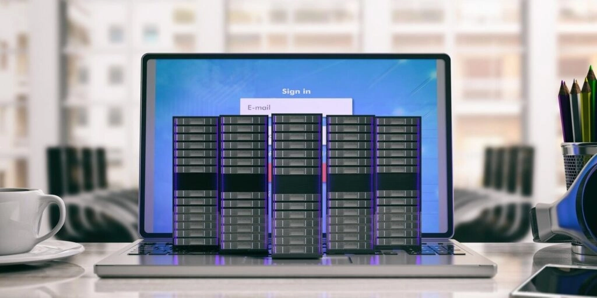

# 德国VPS主机选择指南：9家值得关注的服务商

你在为网站寻找稳定的托管方案吗？如果你的目标用户在德国或欧洲地区，那么选择德国本地的VPS主机就显得格外重要了。服务器离用户越近，网站加载速度就越快，用户体验自然也就越好。

这不是什么高深的理论，就是个很实在的事儿：用户打开网站快了，体验好了，转化率自然上去了。而且Google也会因为你的网站速度快而给你更高的排名。所以说，选对服务器位置，真的能让你的网站赢在起跑线上。

---

## 什么是德国VPS主机？

说白了，就是服务器机房设在德国的VPS（虚拟专用服务器）。

VPS介于共享主机和独立服务器之间——你不用和别人抢资源，但也不用为整台服务器买单。它给你分配一个独立的虚拟空间，有自己的CPU、内存和存储，就像在共享服务器上给你划了块专属地盘。

对于需要更好性能、更高安全性，但又不想花太多钱的网站来说，VPS确实是个不错的选择。而选择德国机房，主要是看中了德国服务器的稳定性和欧洲优质的网络环境。

## 9家德国VPS主机服务商推荐（2025年10月更新）

下面我们来看看几家值得考虑的德国VPS主机提供商。每家都有自己的特点，你可以根据自己的需求来选。

**快速导航：**

1. Kamatera - 综合实力最强
2. UltaHost - 新手友好型
3. ScalaHosting - 可靠且功能全面
4. Hosting.com - 价格实惠
5. FastComet - 完全托管的PHP VPS
6. CloudWays - 云VPS托管
7. Contabo - 快速灵活的云VPS
8. LiquidWeb - 托管VPS速度快
9. Vultr - 快速SSD云服务器

---

### 1. Kamatera - 综合实力最强的德国VPS主机

Kamatera最大的特点就是灵活。你可以完全按照自己的需求来定制配置，想要什么样的CPU、内存、存储都行。不管你是刚起步的小网站，还是已经有一定规模的业务，都能在这里找到合适的方案。

**Kamatera的主要优势：**

🔶 **可扩展性强**：网站流量涨了？没问题，随时升级配置。流量降了？也能降配省钱。整个过程都很顺畅，不会影响网站运行。

🔶 **完全可定制**：从操作系统到硬件配置，你说了算。这样就不用为用不上的功能买单了。

🔶 **每日自动备份**：数据安全有保障，每天自动备份，万一出问题也能快速恢复。

**价格范围**：基础套餐从每月4美元到6美元不等，具体价格取决于你选择的配置。

想要稳定可靠的VPS服务，不妨考虑 👉 [专业的云服务器方案，适合各种规模的业务需求](https://www.vultr.com/?ref=9738262-9J)。无论你是刚起步还是需要扩展现有业务，合适的基础设施都能让你事半功倍。

---

### 2. UltaHost - 适合新手的德国VPS主机

UltaHost特别适合不太懂技术的用户。它提供完全托管服务，意思就是服务器维护、安全更新这些麻烦事儿都有人帮你搞定，你只需要专心做自己的业务就行。

**UltaHost的核心特点：**

🔶 **完全托管服务**：技术问题交给专业团队处理，你可以把时间花在更重要的事情上。

🔶 **测试环境**：上线前可以先在测试环境里试一试，发现问题及时修复，避免影响用户。

🔶 **自定义VPS配置**：需要特定的配置？可以根据实际需求定制，不浪费钱在用不上的资源上。

**价格区间**：
- 免费控制面板方案：5.50美元/月 - 21.50美元/月
- Plesk方案：15.50美元/月 - 31.50美元/月  
- cPanel方案：24.50美元/月 - 40.50美元/月

---

### 3. ScalaHosting - 可靠的德国VPS主机

如果你用WordPress建站，ScalaHosting会是个不错的选择。它专门优化了WordPress的运行环境，网站速度会更快。而且操作界面很友好，即使是第一次接触VPS的人也能快速上手。

**ScalaHosting的亮点：**

🔶 **WordPress工具包**：提供一整套WordPress专用工具，包括网站克隆、测试环境等，管理起来特别方便。

🔶 **定时任务功能**：很多重复性工作可以设置自动执行，节省不少时间。

🔶 **多种控制面板选择**：可以选择cPanel或者他们自己开发的SPanel，看你习惯哪个。

---

### 4. Hosting.com - 价格实惠的德国VPS主机

Hosting.com的优势在于性价比。它提供托管服务，但价格相对便宜。网站速度也不错，对于预算有限但又想要可靠服务的用户来说，值得考虑。

**Hosting.com的特色功能：**

🔶 **免费网站迁移**：从其他主机搬过来？他们帮你免费迁移，数据不会丢失。

🔶 **免费SSL证书**：网站安全连接必备，他们直接提供，不用额外花钱。

🔶 **灵活配置**：多种配置方案可选，找到最适合自己需求的那一款。

**价格范围**：
- 托管主机：33.00美元/月 - 55.50美元/月
- 非托管主机：4.99美元/月 - 31.99美元/月

---

### 5. FastComet - 全托管PHP VPS主机

FastComet是个功能很全的平台。除了基本的VPS服务，还提供很多实用工具，特别是对WordPress用户来说，这里有完整的WordPress工具包，从安装到管理都很方便。

**FastComet的主要功能：**

🔶 **WordPress工具包**：一键搞定WordPress的安装、克隆、备份等操作。

🔶 **Softaculous应用安装器**：想装各种网站应用？一键安装，简单快捷。

🔶 **无限网站托管**：一个VPS可以放多个网站，配合cPanel使用特别方便。

---

### 6. CloudWays - 托管云VPS主机

CloudWays比较特别，它不是自己提供服务器，而是帮你管理其他大平台的服务器，比如DigitalOcean、AWS和谷歌云。你既能享受这些大平台的稳定性，又有CloudWays提供的便捷管理界面。

**CloudWays的优势：**

🔶 **测试环境**：上线前可以充分测试，确保一切正常。

🔶 **实时监控**：随时掌握网站运行状态，有问题及时发现。

🔶 **自动修复**：检测到问题会自动尝试修复，减少人工干预。

对于需要稳定可靠云服务的用户，选择 👉 [经过市场验证的云基础设施平台](https://www.vultr.com/?ref=9738262-9J) 能帮你避开很多坑。毕竟服务器的稳定性直接关系到业务的正常运转。

---

### 7. Contabo - 快速灵活的德国云VPS

Contabo是德国本土的主机商，服务器就在德国，网络质量很好。它提供的配置选择很多，而且操作界面比较灵活，可以根据自己的习惯选择不同的控制面板。

**Contabo的特点：**

🔶 **专属控制面板**：使用他们自己开发的控制面板，针对VPS管理做了优化。

🔶 **DDoS防护**：内置防护机制，网站安全有保障。

🔶 **备份和快照**：随时可以给服务器拍个快照，出问题了能快速恢复。

---

### 8. LiquidWeb - 快速托管VPS主机

LiquidWeb走的是高端路线，提供完全托管服务。你基本不用操心服务器的事儿，他们的技术团队会帮你处理好一切。虽然价格稍贵，但服务确实到位。

**LiquidWeb的核心优势：**

🔶 **弹性扩展**：资源用完了可以随时加，用不完也能降配节省成本。

🔶 **CloudFlare CDN**：集成了CloudFlare加速，全球访问速度都有保障。

🔶 **多种控制面板**：Plesk和cPanel都支持，看你喜欢哪个。

---

### 9. Vultr - 快速SSD云服务器

Vultr以速度快著称，用的都是SSD固态硬盘，读写速度比传统硬盘快很多。而且他们的客户支持做得不错，遇到问题能很快得到回应。

**Vultr的亮点：**

🔶 **SSD存储**：速度快，稳定性好，网站响应更迅速。

🔶 **一键安装**：很多常用应用可以一键部署，省去复杂的配置过程。

---

## 为什么选择德国VPS主机？

主要原因有两个：

**第一，地理位置优势。** 如果你的用户主要在德国或欧洲，选择德国机房能让网站访问速度更快。距离近了，数据传输延迟就低，用户体验自然更好。

**第二，数据安全。** 欧洲对数据隐私保护有严格的法规（比如GDPR），德国的服务器在这方面做得比较到位，数据安全更有保障。

## 常见问题

**有免费的德国VPS试用吗？**
有些服务商提供试用期，一般是3到45天不等。

**哪家德国VPS最便宜？**
Kamatera的基础套餐比较实惠，而且可以按需定制，只为实际使用的资源付费。

**后期可以升级配置吗？**
大多数服务商都支持弹性升级，网站规模大了可以随时加配置。

**德国VPS适合电商网站吗？**
如果客户主要在德国或欧洲，德国VPS是不错的选择。

---

## 总结

选VPS主机，关键是找到适合自己的。看预算、看需求、看技术水平。预算充足想省心，就选全托管服务；想自己折腾，就选配置灵活的；刚起步预算有限，就找性价比高的。

德国VPS的优势很明显：服务器位置好、网络质量高、数据保护严。如果你的业务面向欧洲市场，选择德国机房确实是个明智的决定。网站速度快了，用户满意了，生意自然就好做了。
